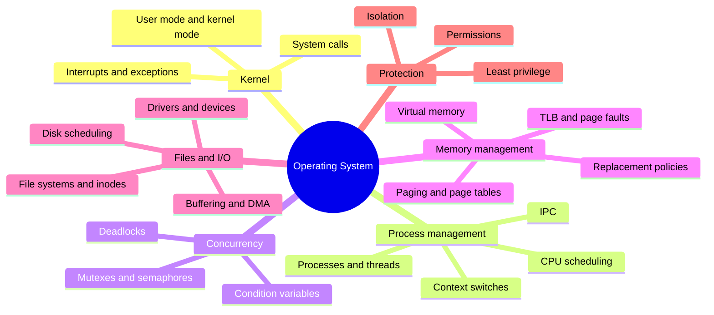
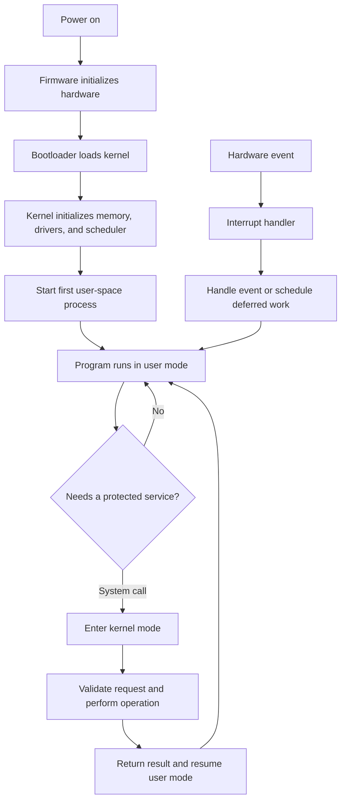
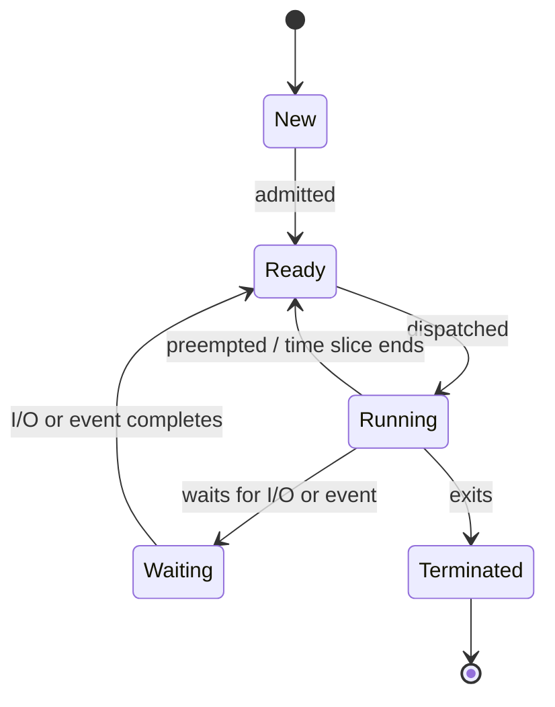
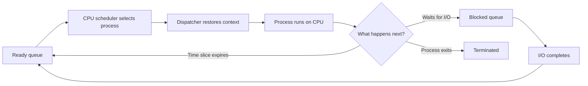
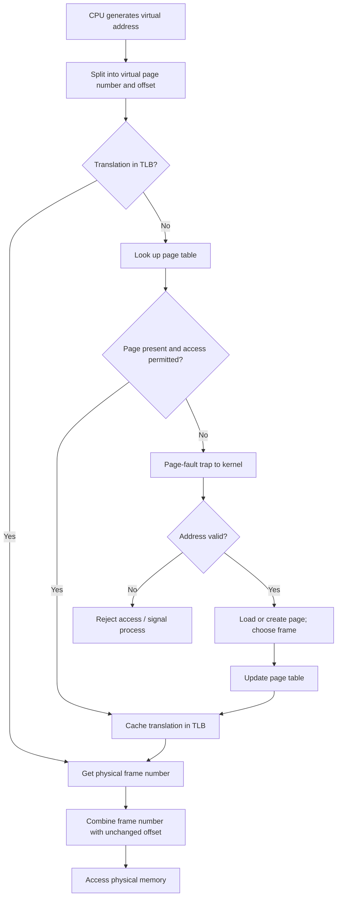
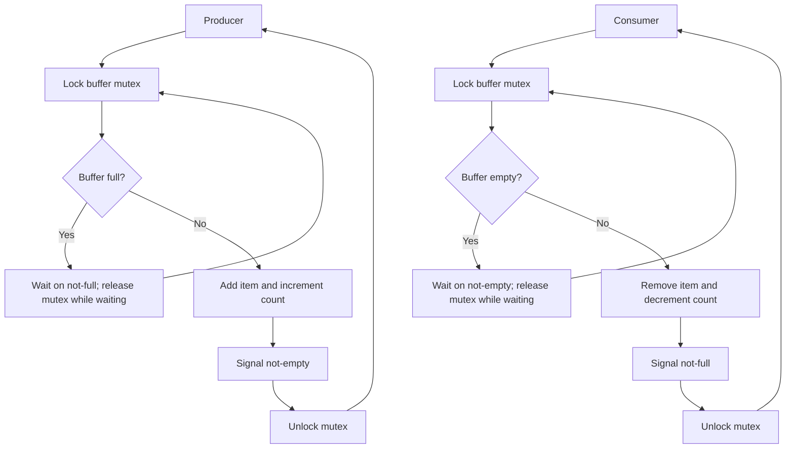
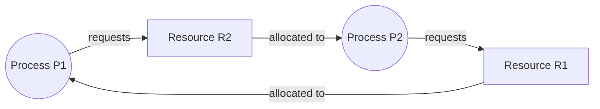

# Operating Systems Diagrams

Mermaid diagrams for the core concepts covered in [OSnotes.md](OSnotes.md) and [Oscode.md](Oscode.md). Render this file in a Markdown viewer that supports Mermaid.

## OS Mind Map

## Boot and Program Execution

## Process State and Scheduling

The scheduler chooses a process from the ready queue. The dispatcher performs the context switch to that process.

## Virtual Address Translation

## Producer-Consumer Synchronization

Invariant: `0 <= count <= capacity`. Use `while` to recheck the condition after every wakeup.

## Deadlock: Resource Allocation Graph

With one instance of each resource, this cycle means deadlock: P1 holds R1 and waits for R2, while P2 holds R2 and waits for R1. A consistent global lock order prevents this circular-wait pattern.
