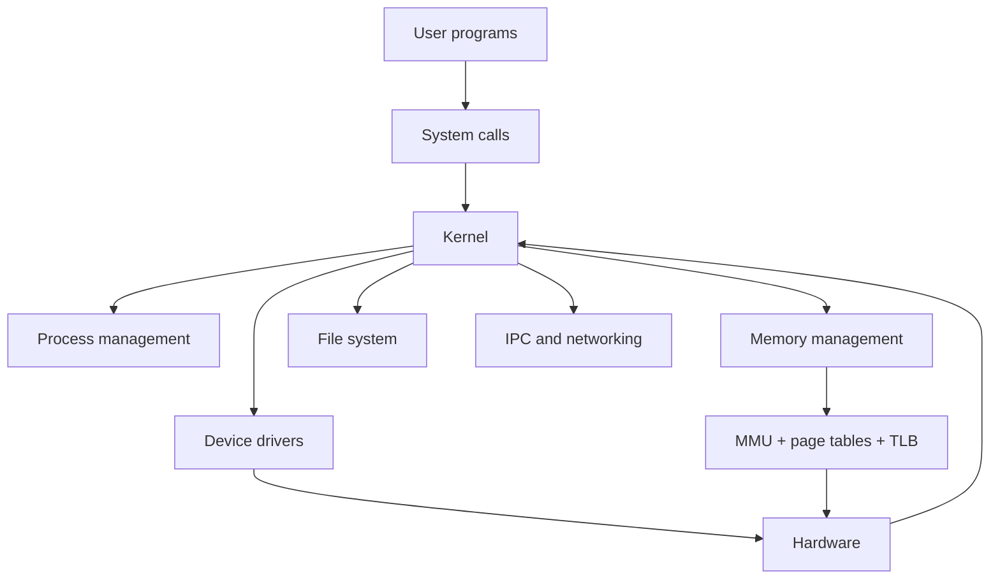
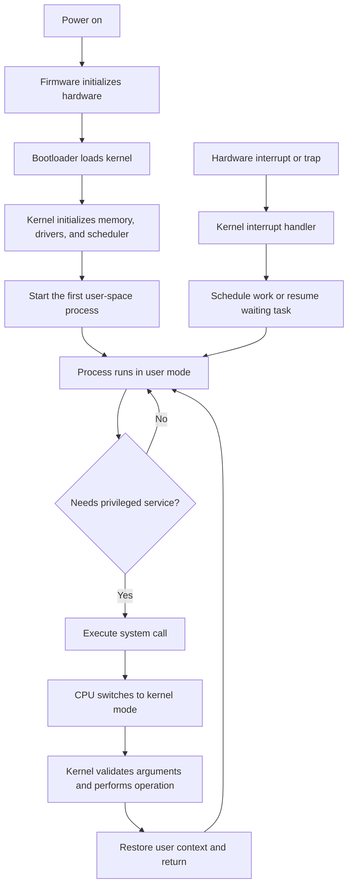
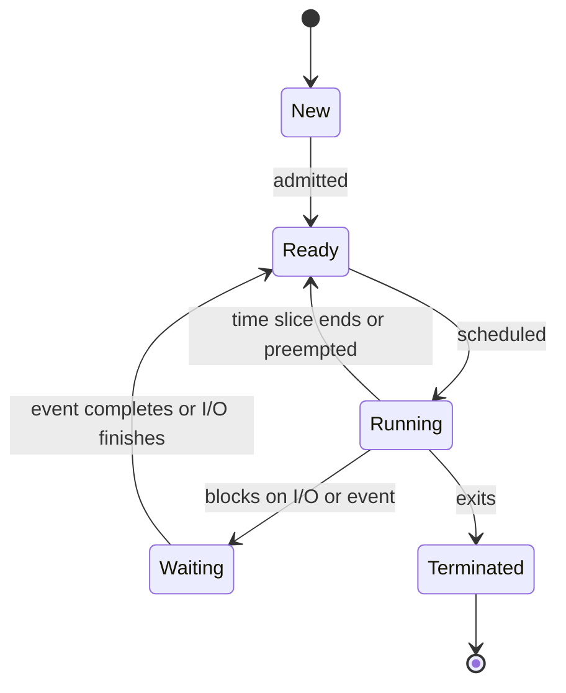
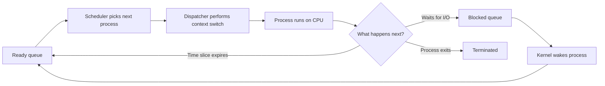
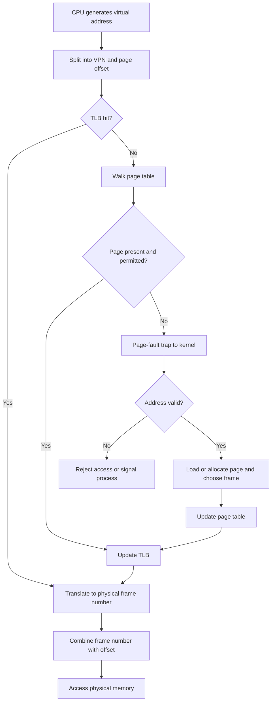
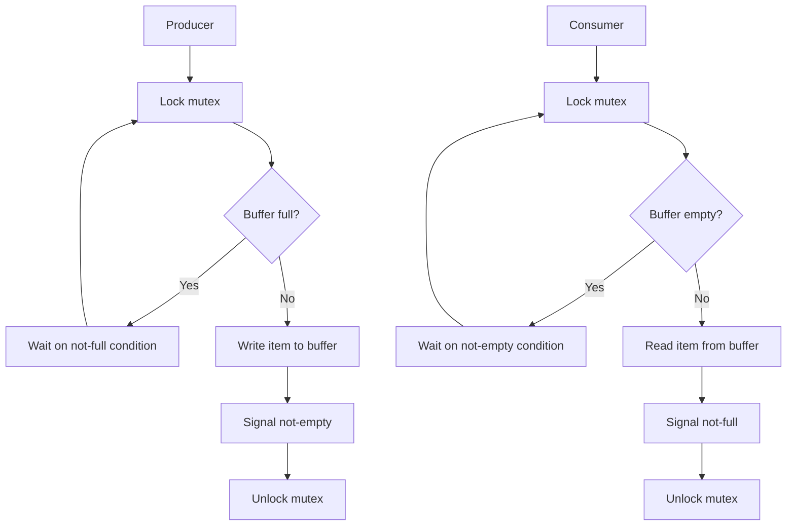
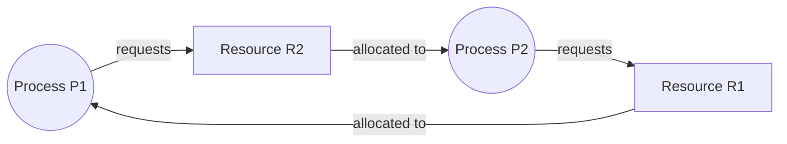
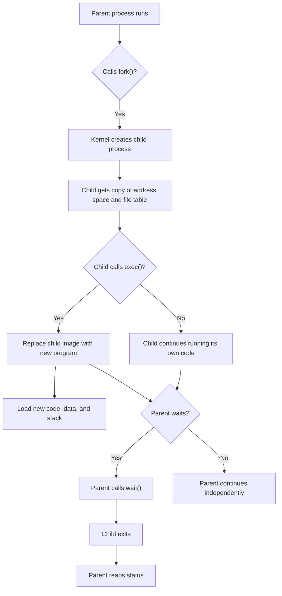
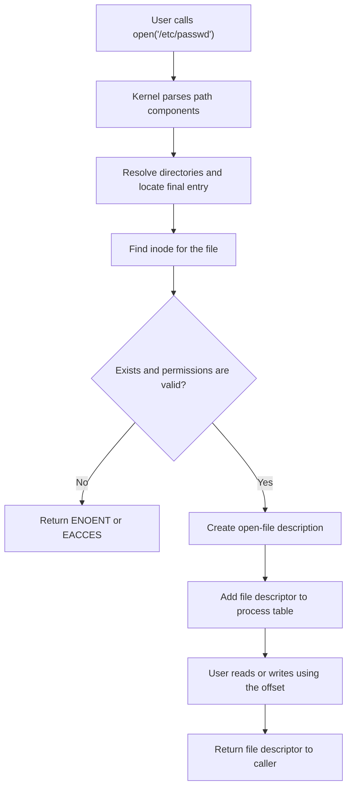

# Operating Systems Diagrams

This file shows the core operating-system ideas as clean Mermaid diagrams. The diagrams below focus on the flow of control, memory, and resources in a Linux-like system.

## 1. OS Architecture

The kernel is the privileged layer that mediates user requests to hardware and enforces protection, isolation, and resource sharing.

## 2. Boot and Program Execution

This flow shows the boundary between user mode and kernel mode. Protected operations require a controlled transition through the kernel.

## 3. Process States and Scheduling

The ready queue holds runnable tasks; the scheduler chooses which one gets CPU time, and the dispatcher restores the selected context.

## 4. Virtual Memory Translation

A TLB reduces repeated page-table walks. A page fault occurs when the requested virtual page is not mapped or is not currently resident.

## 5. Producer-Consumer Synchronization

The key invariant is: `0 <= count <= capacity`. Conditions must be checked in a loop, not with a single test, after every wakeup.

## 6. Deadlock with Resource Allocation Graph

This cycle shows circular wait: P1 holds R1 and waits for R2, while P2 holds R2 and waits for R1. A global lock-order rule prevents this pattern.

## 7. `fork` and `exec`

`fork()` creates a new process; `exec()` replaces the current process image without creating another process. They are often used together to start a new program from a parent.

## 8. File Lookup and Open

The path lookup flow includes directory traversal, inode lookup, validation, and descriptor creation. Caches and the VFS layer may hide lower-level device details.

## 9. I/O and Hardware Interaction

Interrupt-driven I/O and DMA reduce CPU overhead. The kernel coordinates the transfer and only interrupts the CPU when the device is ready or the operation completes.
